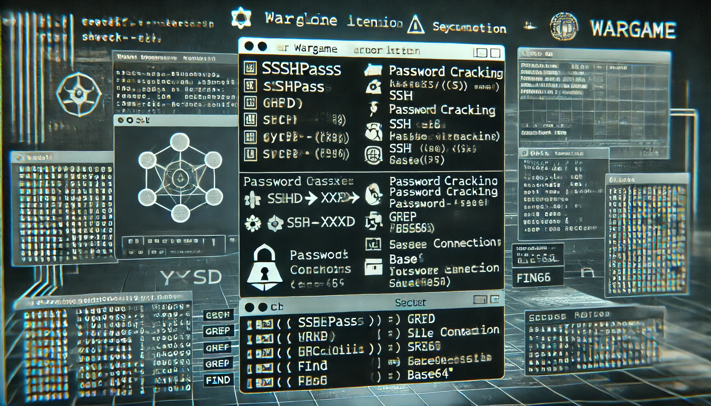

# Wargame: Bandit

  

The Bandit wargame from OverTheWire is a beginner-friendly resource designed to introduce players to the basics of Linux and command-line tools. It consists of a series of challenges (or "levels") that progressively teach key skills like file manipulation, permissions, SSH, and more. Players learn how to navigate a Linux environment, analyze files, and use common commands to solve problems.

**Key Features:**

- Focused on practical learning through problem-solving.
- Ideal for those new to cybersecurity or Linux systems.
- Teaches essential concepts like finding hidden files, handling permissions, and using text processing tools.

**The Solutions for the levels are the following:**

| [Level 0](https://github.com/Cristian5tarellas/Wargames/blob/Bandit/Bandit/Level_0.md) | [Level 1](https://github.com/Cristian5tarellas/Wargames/blob/Bandit/Bandit/Level_01.md) | [Level 2](https://github.com/Cristian5tarellas/Wargames/blob/Bandit/Bandit/Level_02.md) | [Level 3](https://github.com/Cristian5tarellas/Wargames/blob/Bandit/Bandit/Level_03.md) | [Level 4](https://github.com/Cristian5tarellas/Wargames/blob/Bandit/Bandit/Level_04.md) | [Level 5](https://github.com/Cristian5tarellas/Wargames/blob/Bandit/Bandit/Level_05.md)
| --- | --- | --- | --- | --- | --- |
| [Level 6](https://github.com/Cristian5tarellas/Wargames/blob/Bandit/Bandit/Level_06.md) | [Level 7](https://github.com/Cristian5tarellas/Wargames/blob/Bandit/Bandit/Level_07.md) | [Level 8](https://github.com/Cristian5tarellas/Wargames/blob/Bandit/Bandit/Level_08.md) | [Level 9](https://github.com/Cristian5tarellas/Wargames/blob/Bandit/Bandit/Level_09.md) | [Level 10](https://github.com/Cristian5tarellas/Wargames/blob/Bandit/Bandit/Level_10.md) | [Level 11](https://github.com/Cristian5tarellas/Wargames/blob/Bandit/Bandit/Level_11.md)
| [Level 12](https://github.com/Cristian5tarellas/Wargames/blob/Bandit/Bandit/Level_12.md) | [Level 13](https://github.com/Cristian5tarellas/Wargames/blob/Bandit/Bandit/Level_03.md) | [Level 14](https://github.com/Cristian5tarellas/Wargames/blob/Bandit/Bandit/Level_03.md) | [Level 15](https://github.com/Cristian5tarellas/Wargames/blob/Bandit/Bandit/Level_03.md)
