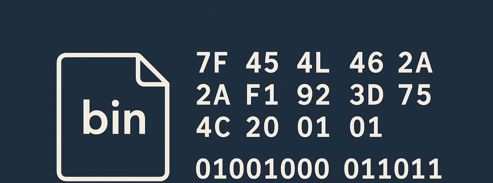

# Wargame: Leviathan

Leviathan is a beginner-friendly wargame hosted by OverTheWire that introduces key concepts in Linux, cybersecurity, and privilege escalation. It's designed for those starting out in ethical hacking and looking to build a strong foundation in system-level thinking and command-line skills.

To start with Leviathan, visit the OverTheWire website, where you'll find detailed instructions and resources for each level. Engaging with the Krypton wargame offers a practical and interactive approach to learning cryptography, making it an excellent resource for anyone interested in the field.

[Wargame: Leviathan](https://overthewire.org/wargames/leviathan/)
