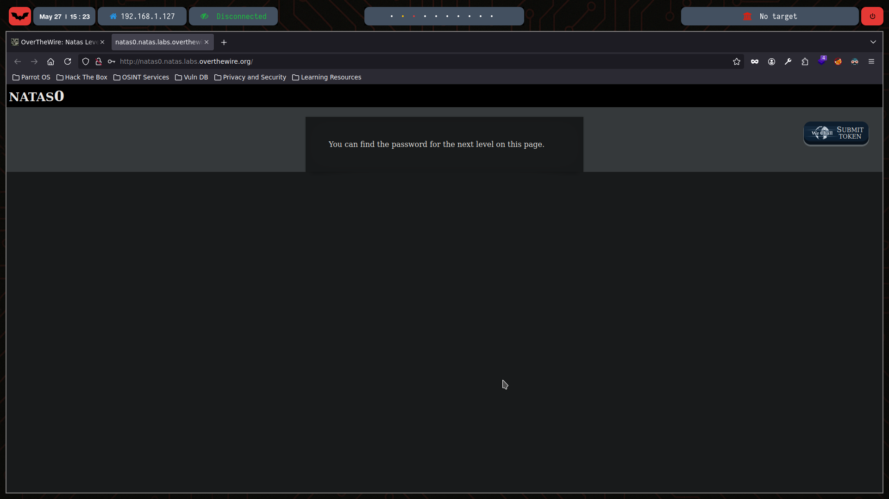
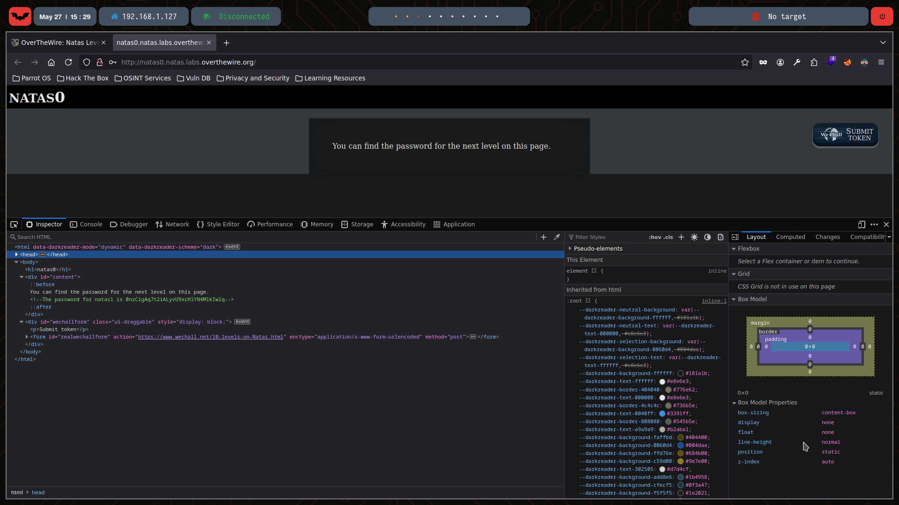

# Natas Level 0

You can watch the walkthrough for this level here:  
[](https://www.youtube.com/watch?v=VI_WdkhbFpI&t=11s&ab_channel=Gabahack)

> This video shows my full process solving (in Spanish) Level 0 and Level 1 from scratch, including the obstacles and mistakes I faced along the way. Some walkthroughs might be longer or shorter depending on the complexity of the level or how quickly I find the solution.

---

## 🔍 Exploration

In Level 0, we have the information needed to access the [first level](http://natas0.natas.labs.overthewire.org):

- **Username:** natas0  
- **Password:** natas0  
- **URL:** [http://natas0.natas.labs.overthewire.org](http://natas0.natas.labs.overthewire.org)

When visiting the page, we see:



Another way to retrieve the entire webpage’s HTML content is by using the `curl` command:

```bash
❯ curl -u natas0:natas0  http://natas0.natas.labs.overthewire.org/
<html>
<head>
<!-- This stuff in the header has nothing to do with the level -->
<link rel="stylesheet" type="text/css" href="http://natas.labs.overthewire.org/css/level.css">
<link rel="stylesheet" href="http://natas.labs.overthewire.org/css/jquery-ui.css" />
<link rel="stylesheet" href="http://natas.labs.overthewire.org/css/wechall.css" />
<script src="http://natas.labs.overthewire.org/js/jquery-1.9.1.js"></script>
<script src="http://natas.labs.overthewire.org/js/jquery-ui.js"></script>
<script src=http://natas.labs.overthewire.org/js/wechall-data.js></script><script src="http://natas.labs.overthewire.org/js/wechall.js"></script>
<script>var wechallinfo = { "level": "natas0", "pass": "natas0" };</script></head>
<body>
<h1>natas0</h1>
<div id="content">
You can find the password for the next level on this page.

<!--The password for natas1 is 0nzCigAq7t2iALyvU9xcHlYN4MlkIwlq -->
</div>
</body>
</html>
```
We use the `-u` parameter to provide the username and password. With `curl`, we can see the same HTML code we’d get directly by visiting the webpage:



## 💣 Exploitation
Interestingly, we can observe the password for the next level inside a comment:
```html
<!--The password for natas1 is 0nzCigAq7t2iALyvU9xcHlYN4MlkIwlq -->
```

## 🔐 Password for Natas 1
0nzCigAq7t2iALyvU9xcHlYN4MlkIwlq
