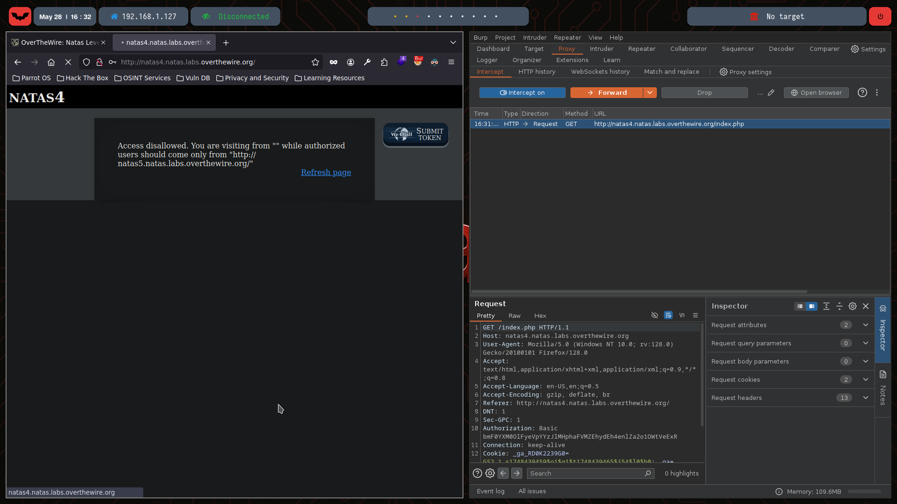
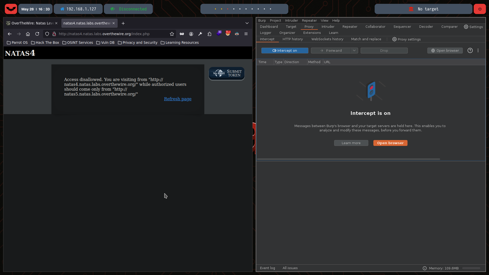
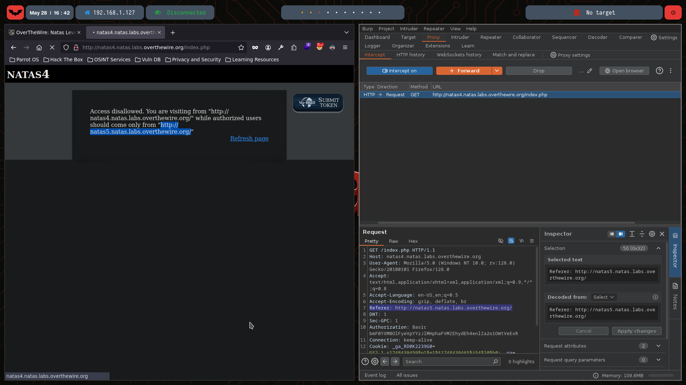
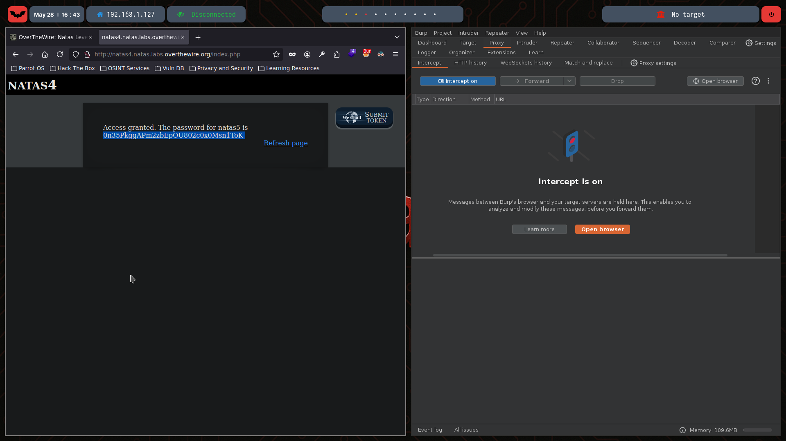

# Natas Level 4

You can watch the walkthrough for this level here:  
[](https://www.youtube.com/watch?v=M_ZLTDom60o)

> This video shows my full process solving (in Spanish) Level 4 from scratch, including the obstacles and mistakes I faced along the way. Some walkthroughs might be longer or shorter depending on the complexity of the level or how quickly I find the solution.

---

## 🔍 Exploration

We start by checking the HTML content of this level using the `curl` command:

```bash
❯ curl -u natas4:QryZXc2e0zahULdHrtHxzyYkj59kUxLQ  http://natas4.natas.labs.overthewire.org/
<html>
<head>
<!-- This stuff in the header has nothing to do with the level -->
<link rel="stylesheet" type="text/css" href="http://natas.labs.overthewire.org/css/level.css">
<link rel="stylesheet" href="http://natas.labs.overthewire.org/css/jquery-ui.css" />
<link rel="stylesheet" href="http://natas.labs.overthewire.org/css/wechall.css" />
<script src="http://natas.labs.overthewire.org/js/jquery-1.9.1.js"></script>
<script src="http://natas.labs.overthewire.org/js/jquery-ui.js"></script>
<script src=http://natas.labs.overthewire.org/js/wechall-data.js></script><script src="http://natas.labs.overthewire.org/js/wechall.js"></script>
<script>var wechallinfo = { "level": "natas4", "pass": "QryZXc2e0zahULdHrtHxzyYkj59kUxLQ" };</script></head>
<body>
<h1>natas4</h1>
<div id="content">

Access disallowed. You are visiting from "" while authorized users should come only from "http://natas5.natas.labs.overthewire.org/"
<br/>
<div id="viewsource"><a href="index.php">Refresh page</a></div>
</div>
</body>
</html>
```
We can see that there’s a link to refresh the page. To better understand what’s happening, let’s intercept the request using Burp Suite:

- **Initial interception (captured request):**


- **After forwarding the request:**


We notice an interesting field in the captured headers: Referer.

ℹ️ In HTTP, Referer is an optional header that identifies the address of the webpage from which the resource was requested.

In the second image, we see that the message has changed:

> Access disallowed. You are visiting from "http://natas4.natas.labs.overthewire.org/" while authorized users should come only from "http://natas5.natas.labs.overthewire.org/".


## 💣 Exploitation

It’s clear that the webpage checks the Referer header to verify if the request came from the expected location.

To bypass this restriction, we can capture the request and modify the Referer header to the expected value: `Referer: http://natas5.natas.labs.overthewire.org/`

This can be seen in the intercepted request:



By forwarding the request with the correct Referer, we get access to the password:



## 🔐 Password for Natas 5

0n35PkggAPm2zbEpOU802c0x0Msn1ToK 
