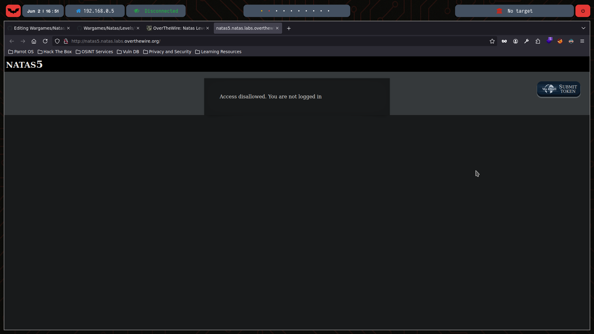
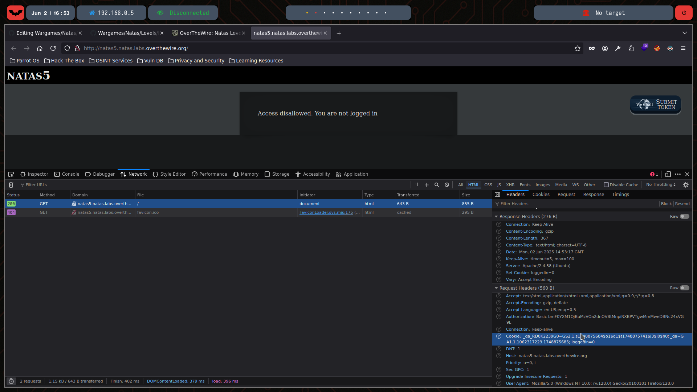
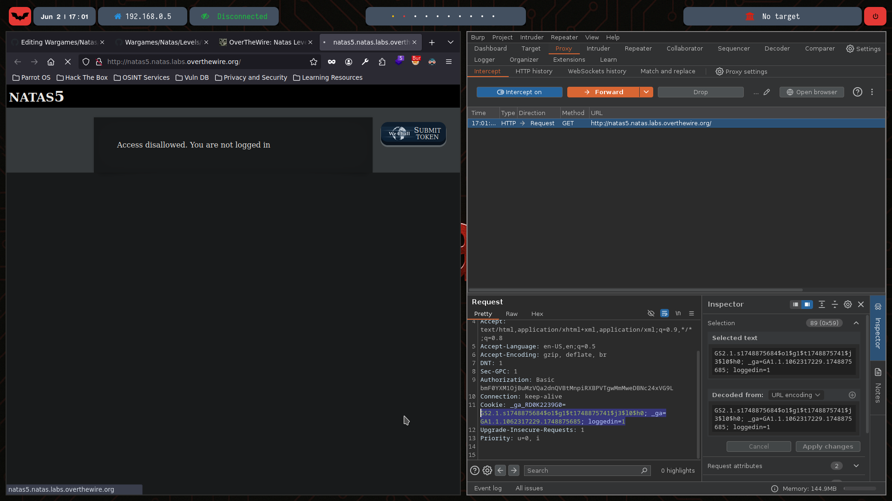
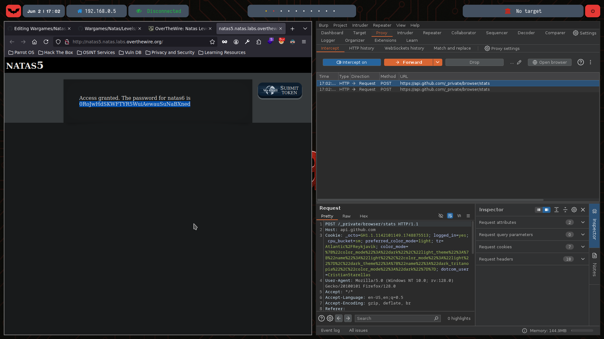

# Natas Level 5

You can watch the walkthrough for this level here:  
[](https://www.youtube.com/watch?v=PzoYH9AynXE&ab_channel=Gabahack)

> This video shows my full process solving (in Spanish) Level 5 from scratch, including the obstacles and mistakes I faced along the way. Some walkthroughs might be longer or shorter depending on the complexity of the level or how quickly I find the solution.

---

## 🔍 Exploration

We start by checking the HTML content of this level using the `curl` command:
```bash
❯ curl -u natas5:0n35PkggAPm2zbEpOU802c0x0Msn1ToK  http://natas5.natas.labs.overthewire.org/
<html>
<head>
<!-- This stuff in the header has nothing to do with the level -->
<link rel="stylesheet" type="text/css" href="http://natas.labs.overthewire.org/css/level.css">
<link rel="stylesheet" href="http://natas.labs.overthewire.org/css/jquery-ui.css" />
<link rel="stylesheet" href="http://natas.labs.overthewire.org/css/wechall.css" />
<script src="http://natas.labs.overthewire.org/js/jquery-1.9.1.js"></script>
<script src="http://natas.labs.overthewire.org/js/jquery-ui.js"></script>
<script src=http://natas.labs.overthewire.org/js/wechall-data.js></script><script src="http://natas.labs.overthewire.org/js/wechall.js"></script>
<script>var wechallinfo = { "level": "natas5", "pass": "0n35PkggAPm2zbEpOU802c0x0Msn1ToK" };</script></head>
<body>
<h1>natas5</h1>
<div id="content">
Access disallowed. You are not logged in</div>
</body>
</html>
```

We see the message: `Access disallowed. You are not logged in`



Since it says we’re not logged in, there must be a parameter that determines whether we’re logged in or not. By inspecting the cookies, we find a parameter named loggedin with a value of 0:



## 💣 Exploitation

We can use Burp Suite to intercept the request and modify the loggedin cookie to 1 instead of 0:



Forwarding the modified request grants access to the password for the next level:



## 🔐 Password for Natas 6

0RoJwHdSKWFTYR5WuiAewauSuNaBXned
