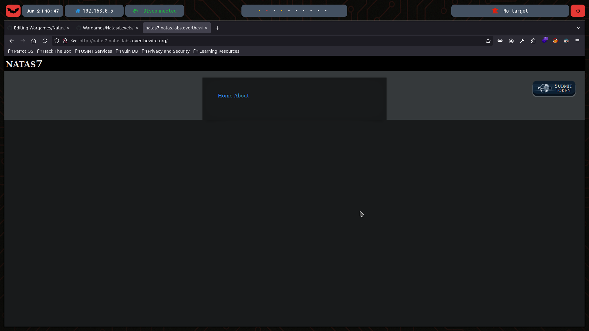
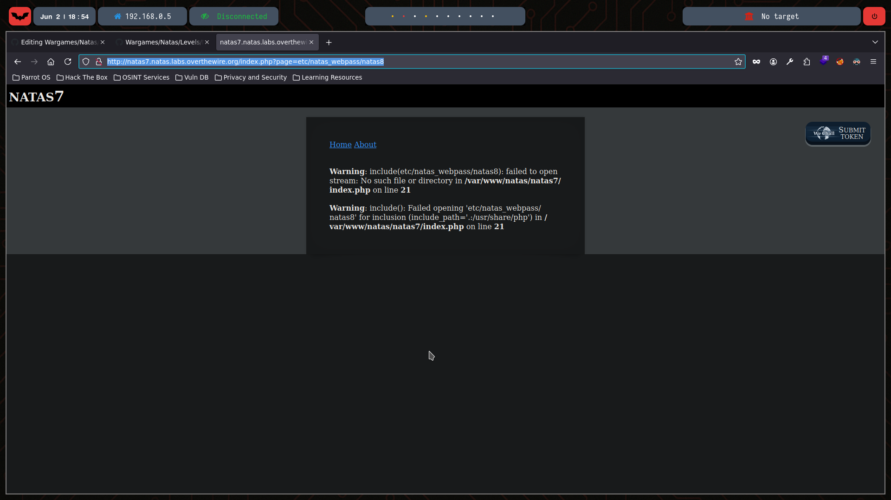
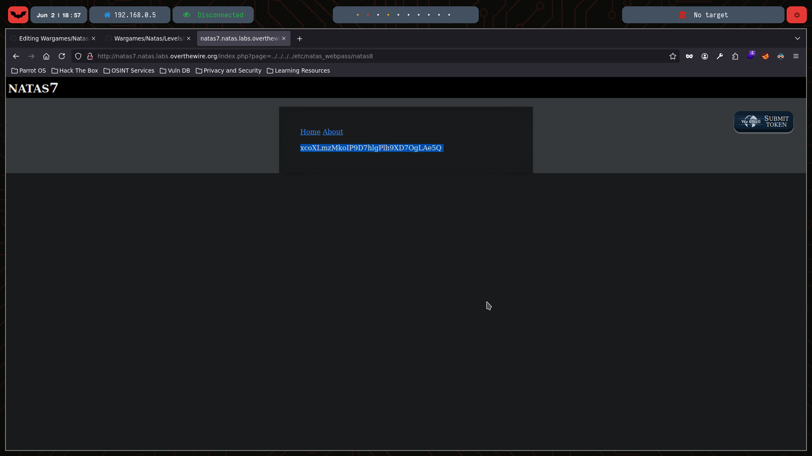

# Natas Level 7

You can watch the walkthrough for this level here:  
[](https://www.youtube.com/watch?v=lG0Iz9tHdIo&ab_channel=Gabahack)

> This video shows my full process solving (in Spanish) Level 7 from scratch, including the obstacles and mistakes I faced along the way. Some walkthroughs might be longer or shorter depending on the complexity of the level or how quickly I find the solution.

---

## 🔍 Exploration

We start by checking the HTML content of this level using the `curl` command:

```bash
❯ curl -u natas7:bmg8SvU1LizuWjx3y7xkNERkHxGre0GS  http://natas7.natas.labs.overthewire.org
<html>
<head>
<!-- This stuff in the header has nothing to do with the level -->
<link rel="stylesheet" type="text/css" href="http://natas.labs.overthewire.org/css/level.css">
<link rel="stylesheet" href="http://natas.labs.overthewire.org/css/jquery-ui.css" />
<link rel="stylesheet" href="http://natas.labs.overthewire.org/css/wechall.css" />
<script src="http://natas.labs.overthewire.org/js/jquery-1.9.1.js"></script>
<script src="http://natas.labs.overthewire.org/js/jquery-ui.js"></script>
<script src=http://natas.labs.overthewire.org/js/wechall-data.js></script><script src="http://natas.labs.overthewire.org/js/wechall.js"></script>
<script>var wechallinfo = { "level": "natas7", "pass": "bmg8SvU1LizuWjx3y7xkNERkHxGre0GS" };</script></head>
<body>
<h1>natas7</h1>
<div id="content">

<a href="index.php?page=home">Home</a>
<a href="index.php?page=about">About</a>
<br>
<br>

<!-- hint: password for webuser natas8 is in /etc/natas_webpass/natas8 -->
</div>
</body>
</html>
```
This is how the page looks in Mozilla:



We see two hyperlinks: **Home** and **About**. Clicking on one of them, for instance Home, we notice the URL changes to: http://natas7.natas.labs.overthewire.org/index.php?page=home


If we modify the URL to: http://natas7.natas.labs.overthewire.org/index.php?page=etc/natas_webpass/natas8

We see:



## 💣 Exploitation
We can manipulate the page parameter to perform a directory traversal attack and read the password file directly: http://natas7.natas.labs.overthewire.org/index.php?page=../../../../etc/natas_webpass/natas8

And we get the password:



## 🔐 Password for Natas 8

xcoXLmzMkoIP9D7hlgPlh9XD7OgLAe5Q 

