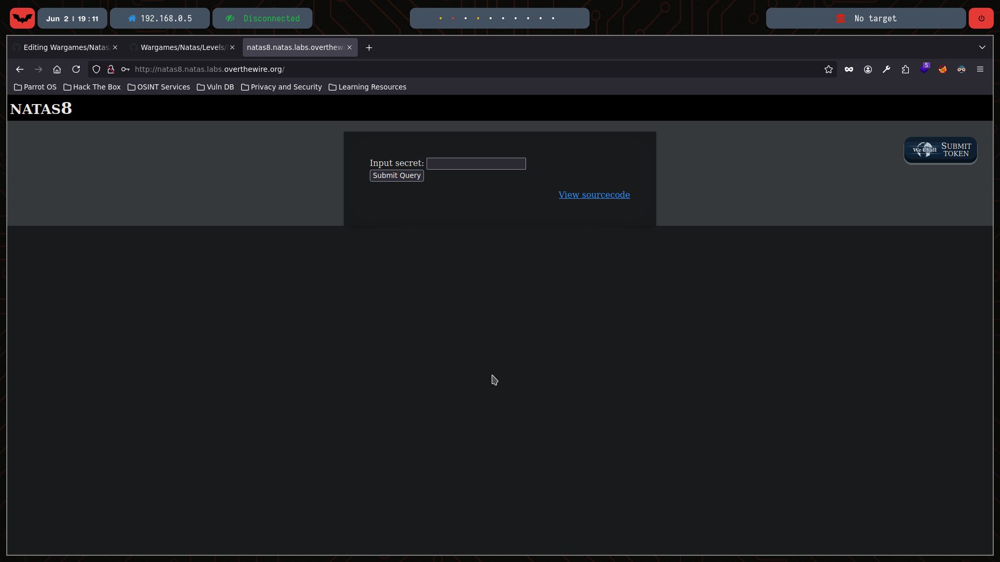
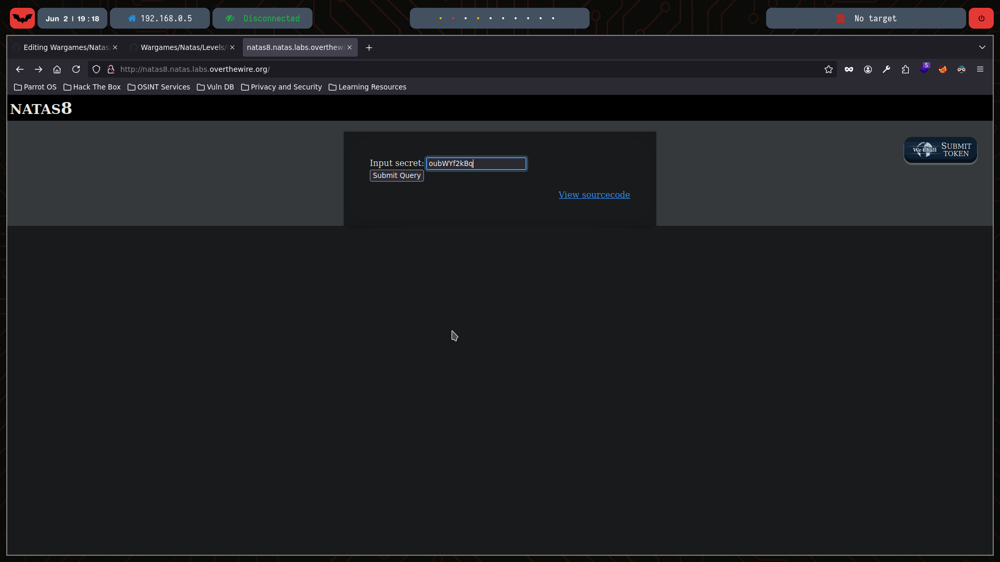
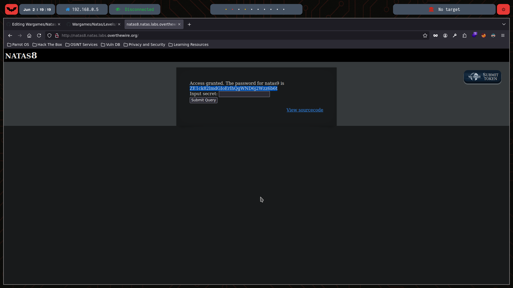

# Natas Level 8

You can watch the walkthrough for this level here:  
[](https://www.youtube.com/watch?v=DkXiyGb_z7w&ab_channel=Gabahack)

> This video shows my full process solving (in Spanish) Level 8 from scratch, including the obstacles and mistakes I faced along the way. Some walkthroughs might be longer or shorter depending on the complexity of the level or how quickly I find the solution.

---

## 🔍 Exploration

We start by checking the HTML content of this level using the `curl` command:

```bash
❯ curl -u natas8:xcoXLmzMkoIP9D7hlgPlh9XD7OgLAe5Q   http://natas8.natas.labs.overthewire.org
<html>
<head>
<!-- This stuff in the header has nothing to do with the level -->
<link rel="stylesheet" type="text/css" href="http://natas.labs.overthewire.org/css/level.css">
<link rel="stylesheet" href="http://natas.labs.overthewire.org/css/jquery-ui.css" />
<link rel="stylesheet" href="http://natas.labs.overthewire.org/css/wechall.css" />
<script src="http://natas.labs.overthewire.org/js/jquery-1.9.1.js"></script>
<script src="http://natas.labs.overthewire.org/js/jquery-ui.js"></script>
<script src=http://natas.labs.overthewire.org/js/wechall-data.js></script><script src="http://natas.labs.overthewire.org/js/wechall.js"></script>
<script>var wechallinfo = { "level": "natas8", "pass": "xcoXLmzMkoIP9D7hlgPlh9XD7OgLAe5Q" };</script></head>
<body>
<h1>natas8</h1>
<div id="content">


<form method=post>
Input secret: <input name=secret><br>
<input type=submit name=submit>
</form>

<div id="viewsource"><a href="index-source.html">View sourcecode</a></div>
</div>
</body>
</html>
```
This is how the page looks in Mozilla:



The page provides a link to view the source code:

```html
<html>
<head>
<!-- This stuff in the header has nothing to do with the level -->
<link rel="stylesheet" type="text/css" href="http://natas.labs.overthewire.org/css/level.css">
<link rel="stylesheet" href="http://natas.labs.overthewire.org/css/jquery-ui.css" />
<link rel="stylesheet" href="http://natas.labs.overthewire.org/css/wechall.css" />
<script src="http://natas.labs.overthewire.org/js/jquery-1.9.1.js"></script>
<script src="http://natas.labs.overthewire.org/js/jquery-ui.js"></script>
<script src=http://natas.labs.overthewire.org/js/wechall-data.js></script><script src="http://natas.labs.overthewire.org/js/wechall.js"></script>
<script>var wechallinfo = { "level": "natas8", "pass": "<censored>" };</script></head>
<body>
<h1>natas8</h1>
<div id="content">

<?

$encodedSecret = "3d3d516343746d4d6d6c315669563362";

function encodeSecret($secret) {
    return bin2hex(strrev(base64_encode($secret)));
}

if(array_key_exists("submit", $_POST)) {
    if(encodeSecret($_POST['secret']) == $encodedSecret) {
    print "Access granted. The password for natas9 is <censored>";
    } else {
    print "Wrong secret";
    }
}
?>

<form method=post>
Input secret: <input name=secret><br>
<input type=submit name=submit>
</form>

<div id="viewsource"><a href="index-source.html">View sourcecode</a></div>
</div>
</body>
</html>
```

We see that the variable $encodedSecret contains a hex-encoded string. The encodeSecret function encodes the input by first base64-encoding it, then reversing it, and finally converting it to hexadecimal.

## 💣 Exploitation

We can decode the variable $encodedSecret by reversing the process:

```bash
❯ echo "3d3d516343746d4d6d6c315669563362" | xxd -r -p | rev | base64 --decode
oubWYf2kBq%
```

 Using the decoded secret in the form:



We gain access to the password for the next level:



## 🔐 Password for Natas 9

ZE1ck82lmdGIoErlhQgWND6j2Wzz6b6t
