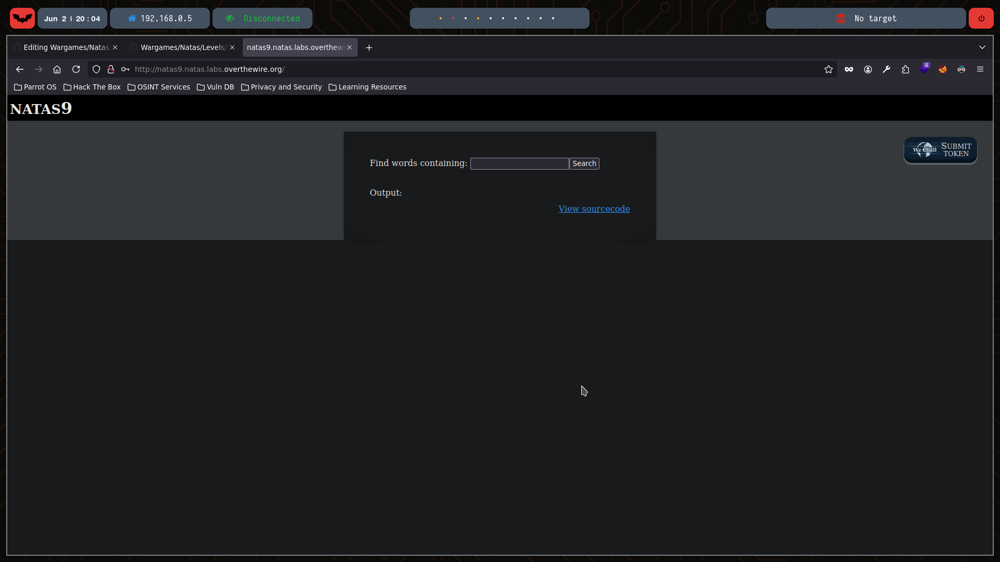
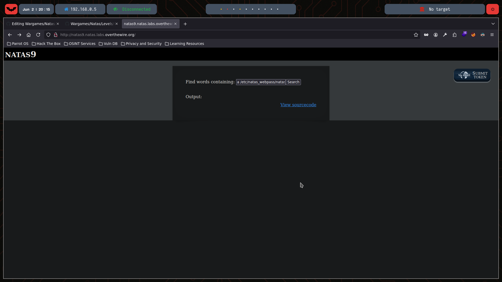
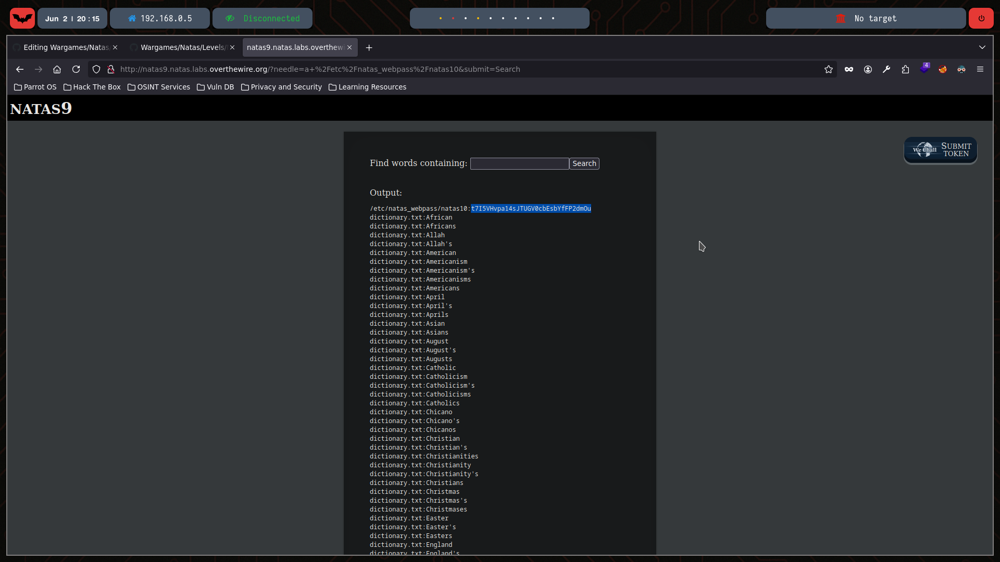

# Natas Level 9

You can watch the walkthrough for this level here:  
[](https://www.youtube.com/watch?v=l8Ae0BaijSE&ab_channel=Gabahack)

> This video shows my full process solving (in Spanish) Level 9 from scratch, including the obstacles and mistakes I faced along the way. Some walkthroughs might be longer or shorter depending on the complexity of the level or how quickly I find the solution.

---

## 🔍 Exploration

We start by checking the HTML content of this level using the `curl` command:

```bash
❯ curl -u natas9:ZE1ck82lmdGIoErlhQgWND6j2Wzz6b6t http://natas9.natas.labs.overthewire.org
<html>
<head>
<!-- This stuff in the header has nothing to do with the level -->
<link rel="stylesheet" type="text/css" href="http://natas.labs.overthewire.org/css/level.css">
<link rel="stylesheet" href="http://natas.labs.overthewire.org/css/jquery-ui.css" />
<link rel="stylesheet" href="http://natas.labs.overthewire.org/css/wechall.css" />
<script src="http://natas.labs.overthewire.org/js/jquery-1.9.1.js"></script>
<script src="http://natas.labs.overthewire.org/js/jquery-ui.js"></script>
<script src=http://natas.labs.overthewire.org/js/wechall-data.js></script><script src="http://natas.labs.overthewire.org/js/wechall.js"></script>
<script>var wechallinfo = { "level": "natas9", "pass": "ZE1ck82lmdGIoErlhQgWND6j2Wzz6b6t" };</script></head>
<body>
<h1>natas9</h1>
<div id="content">
<form>
Find words containing: <input name=needle><input type=submit name=submit value=Search><br><br>
</form>


Output:
<pre>
</pre>

<div id="viewsource"><a href="index-source.html">View sourcecode</a></div>
</div>
</body>
</html>
```

This is how the page looks in Mozilla:



The page provides a link to view the source code:

```html
<html>
<head>
<!-- This stuff in the header has nothing to do with the level -->
<link rel="stylesheet" type="text/css" href="http://natas.labs.overthewire.org/css/level.css">
<link rel="stylesheet" href="http://natas.labs.overthewire.org/css/jquery-ui.css" />
<link rel="stylesheet" href="http://natas.labs.overthewire.org/css/wechall.css" />
<script src="http://natas.labs.overthewire.org/js/jquery-1.9.1.js"></script>
<script src="http://natas.labs.overthewire.org/js/jquery-ui.js"></script>
<script src=http://natas.labs.overthewire.org/js/wechall-data.js></script><script src="http://natas.labs.overthewire.org/js/wechall.js"></script>
<script>var wechallinfo = { "level": "natas9", "pass": "<censored>" };</script></head>
<body>
<h1>natas9</h1>
<div id="content">
<form>
Find words containing: <input name=needle><input type=submit name=submit value=Search><br><br>
</form>


Output:
<pre>
<?
$key = "";

if(array_key_exists("needle", $_REQUEST)) {
    $key = $_REQUEST["needle"];
}

if($key != "") {
    passthru("grep -i $key dictionary.txt");
}
?>
</pre>

<div id="viewsource"><a href="index-source.html">View sourcecode</a></div>
</div>
</body>
</html>
```

Interestingly, we see the line: `passthru("grep -i $key dictionary.txt")`. Here, the key is the input we write on the page.


## 💣 Exploitation

We can exploit this command injection vulnerability by providing a legitimate search term and then appending a command to read the password file for the next level:

```bash
a /etc/natas_webpass/natas10
```

This search term will be passed directly to grep, and then grep will also process the */etc/natas_webpass/natas10* file:



✅ We gain access to the password for the next level:



## 🔐 Password for Natas 10

t7I5VHvpa14sJTUGV0cbEsbYfFP2dmOu


